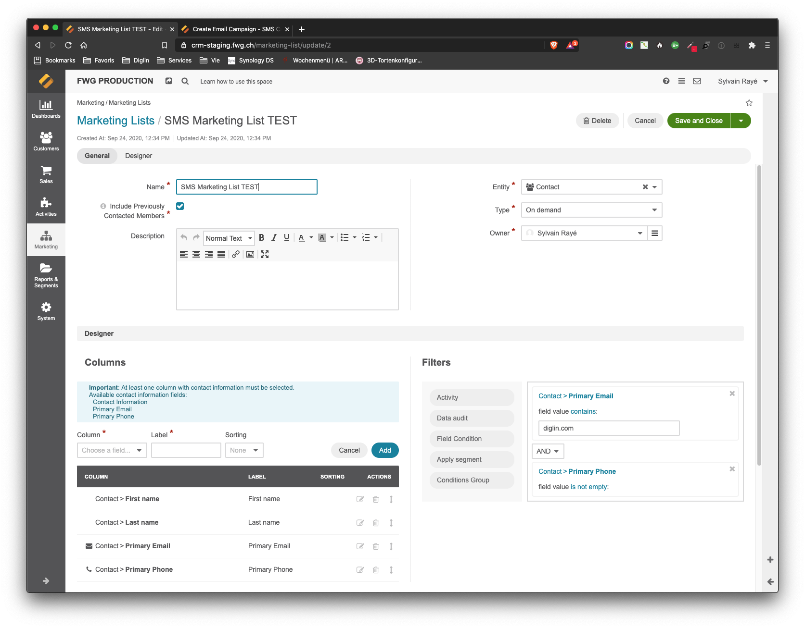
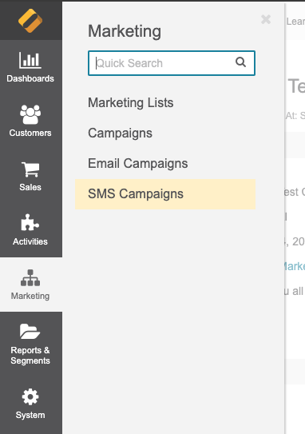
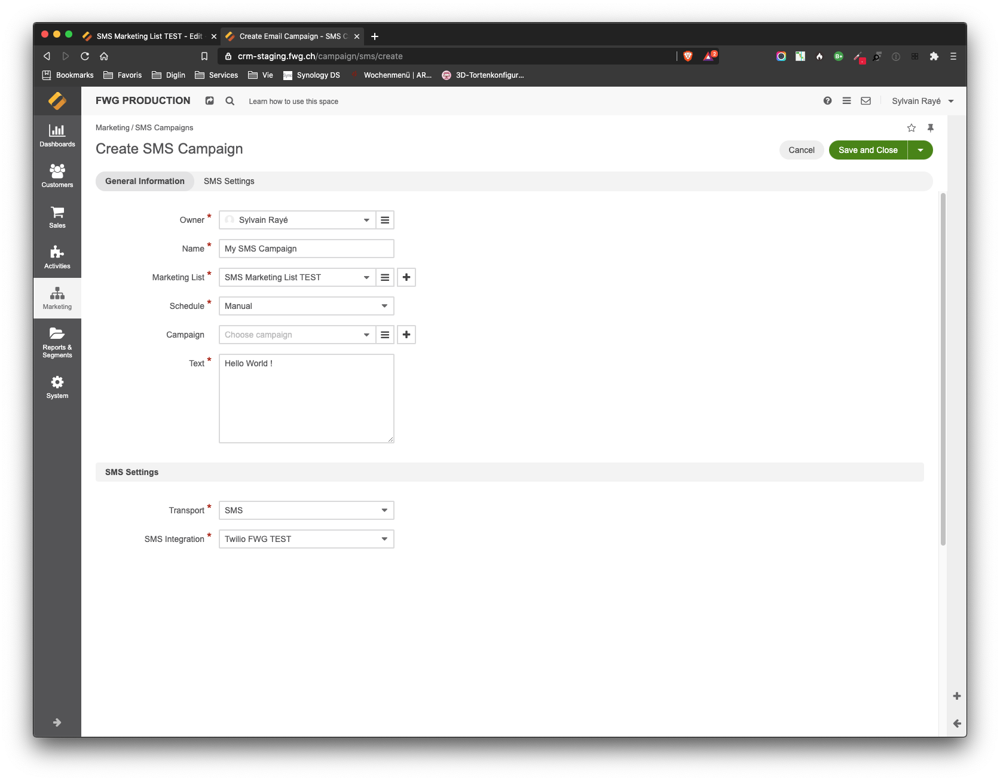
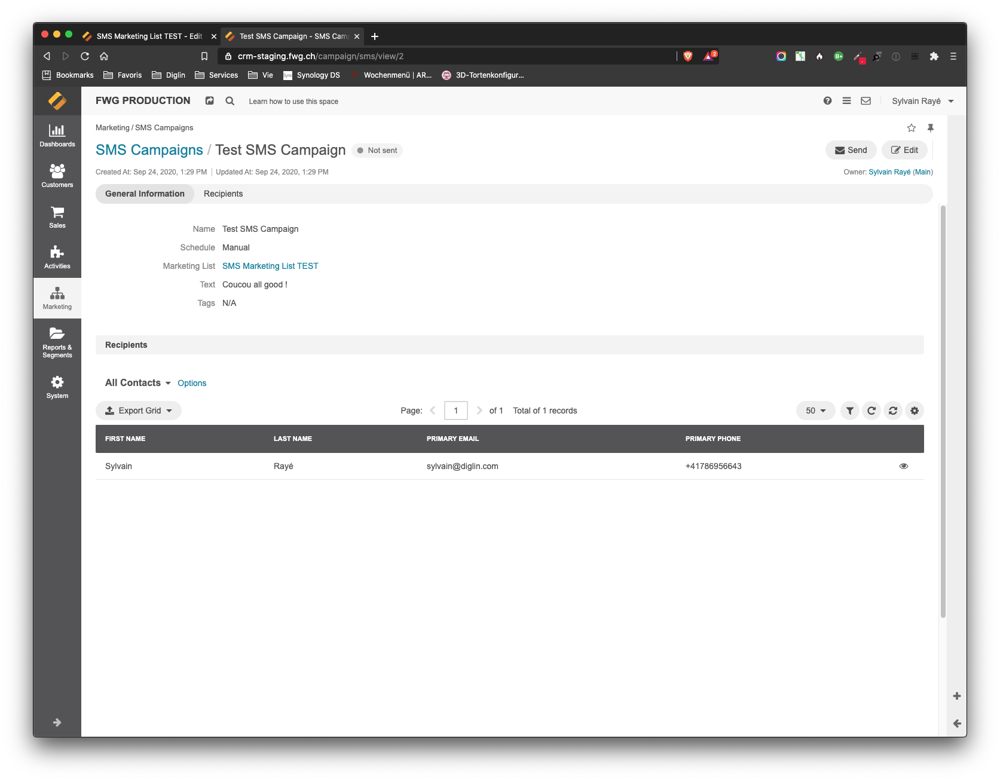

# SMS Campaign for OroCRM

This is the pendent of the Email Campaign feature of OroCRM. It allows to send SMS via marketing list defined and supported SMS Transport.
A SMS Transport is a technical bridge or integration allowing to send SMS. 

## Supported SMS Transport

- Twilio: support SMS and WhatsApp sending. This integration is available against fees, please [contact us](https://www.diglin.com) for more information.

You can create your own, the bundle is enough flexible to allow you to support something else as Twilio. Or if you wish we can develop it for you.

## Installation

`composer require diglin/orocrm-sms-campaign`

## Requirement

- OroCRM 4.x
- An integration supporting SMS Transport must be installed and configured. Like Twilio, see [Supported SMS Transport](#Supported SMS Transport)

## Usage

- Create a Marketing List with a list of people with a phone number following your criteria

  

- Create a SMS Campaign via the menu Marketing > SMS Campaigns

  

  

- Enter the required information like: name, select the previously created Marketing List, a schedule, a text to send

- Select the SMS settings. If SMS Integration list is empty, it means that no SMS Transport has been installed or configured. See the pre-requirement.

- Once you saved your changes, you can send manually the SMS by clicking on the button on the top right on the view page of your SMS campaign or wait for the schedule if this one is configured.

  

## License

[OSL License](LICENSE.txt)

## Author

* Diglin GmbH
* [https://www.diglin.com/](https://www.diglin.com/)
* [@diglin_](https://twitter.com/diglin_)
* [Follow me on github!](https://github.com/diglin)
